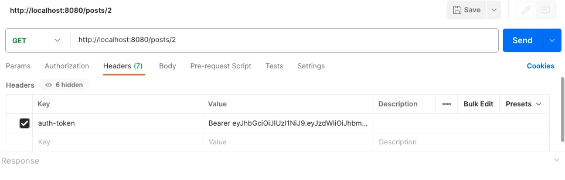

# **Social Media API**
## **Цель проекта:**
 Разработать RESTful API для социальной медиа платформы, позволяющей пользователям регистрироваться, входить в систему, создавать посты, переписываться, подписываться на других пользователей и получать свою ленту активности.


## **Требования к приложению**
**Аутентификация и авторизация:**
  - Пользователи могут зарегистрироваться, указав имя пользователя, электронную почту и пароль.
  - Пользователи могут войти в систему, предоставив правильные учетные данные.
  - API должен обеспечивать защиту конфиденциальности пользовательских данных, включая хэширование паролей и использование JWT.

**1.  Управление постами:**
  - Пользователи могут создавать новые посты, указывая текст, заголовок и прикрепляя изображения.
  - Пользователи могут просматривать посты других пользователей.
  - Пользователи могут обновлять и удалять свои собственные посты.

**2. Взаимодействие пользователей:**
  - Пользователи могут отправлять заявки в друзья другим пользователям. С этого момента, пользователь, отправивший заявку, остается подписчиком до тех пор, пока сам не откажется от подписки. Если пользователь, получивший заявку, принимает ее, оба пользователя становятся друзьями. Если отклонит, то пользователь, отправивший заявку, как и указано ранее, все равно остается подписчиком.
  - Пользователи, являющиеся друзьями, также являются подписчиками друг на друга.
  - Если один из друзей удаляет другого из друзей, то он также отписывается. Второй пользователь при этом должен остаться подписчиком.
  - Друзья могут писать друг другу сообщения (реализация чата не нужна, пользователи могу запросить переписку с помощью запрос а)

**3.  Подписки и лента активности:**
  - Лента активности пользователя должна отображать последние посты от пользователей, на которых он подписан.
  - Лента активности должна поддерживать пагинацию и сортировку по времени создания постов.

**4.  Обработка ошибок:**
  - API должно обрабатывать и возвращать понятные сообщения об ошибках при неправильном запросе или внутренних проблемах сервера.
  - API должно осуществлять валидацию введенных данных и возвращать информативные сообщения при неправильном формате
  
**5.Документация API:**

  - API должно быть хорошо задокументировано с использованием инструментов, таких как Swagger или OpenAPI.
  - Документация должна содержать описания доступных эндпоинтов, форматы запросов и ответов, а также требования к аутентификации.

 

## **Реализация:**
* Приложение (REST-сервис) разработано с использованием **Spring Boot**
* Язык программирования: **Java**
* Реализована авторизация с помощью **JWT-Token Authentication,
Spring Security**
* База данных - **PostgreSQL**
* Сборщик пакетов - **maven**
* Для запуска используется **docker, docker-compose**
* Протестирован с помощью **Postman**
* Тесты: **Unit** , **Mockito**
* Документация API: **OpenAPI**
 


## **1. Запуск BACKEND:**

###  Для запуска REST-сервиса необходимо склонировать проект.

Запустить PostgreSQL командой:
```
docker-compose up
```
Backend проект запустится на порту **8080**

При запуске приложения, в базе автоматически создадутся :

**Tаблицы**:
* users,
* roles,
* user_roles,
* posts,
* followers,
* friendships,
* messages

**Действия:**

* Необходимо создать несколько пользователей по эндпойнту:
http://localhost:8080/register

*  Логирование происходит по эндпойнту:
http://localhost:8080/login

* Далее авторизованный пользователь может совершать различные операции:

1. Работать с постами - создавать посты с изображением, получать по id, получать список своих постов, получать список всех постов, редактировать и удалять посты.
2. Добавлять и удалять друзей, становиться подписчиком кого-либо, удалять подписку, получать список всех своих дружб.
3. Писать сообщения друзьям и видеть переписку.
4. Смотреть ленту последних постов пользователей.

Чтобы иметь доступ ко всем этим операциям в header должен быть отправлен auth-token, который пользователь получил при логировании.





